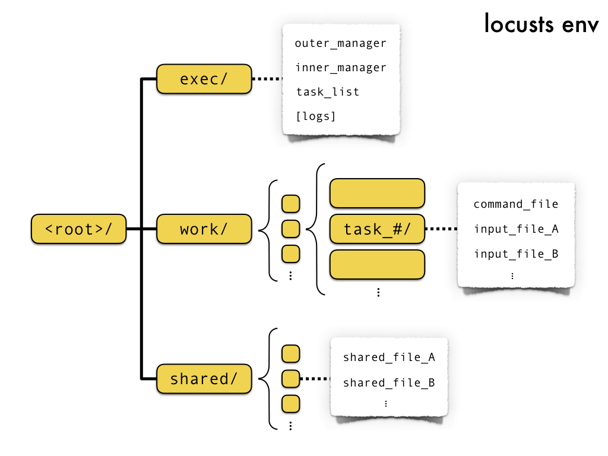
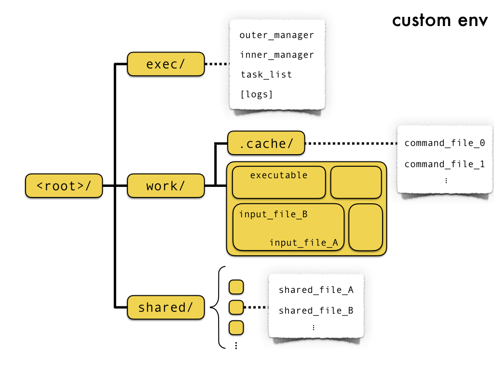

# Locusts

Locusts is a Python package for distributing many small jobs on a system (which can be your machine or a remote HPC running SLURM).

## Installation

Locusts package is currently part of the [PyPI](https://test.pypi.org) Test archive.
In order to install it, type

`python3 -m pip install --index-url https://test.pypi.org/simple/ --no-deps locusts`

Note: PyPI Test is not a permanent archive. Expect this installation procedure to change over time.

## How it works

Locusts is thought for whom has to run a **huge amount of small, independent jobs** and has problems with the most used schedulers which will scatter the jobs over over too many nodes, or queue them indefinitely.
Moreover, this package provides a **safe, clean environment for each job instance**, and keeps and collects notable inputs and outputs.
In short, locusts creates a minimal filesystem where it prepares one environment for each job it has to execute. The runs are directed by a manager bash script, which schedules them and reports its stauts and the one of the jobs to the main locusts routine, which will always be run locally. Finally, it checks for a set of compulsory output files and compiles a list of success and failures.

### Modes

Locusts can help you distributing your jobs when you are facing one of these three situations:
* You want to run everything on your local machine (**local mode**)
* You want to submit jobs to a HPC (**remote mode**)
* You want to submit jobs to a HPC which shares a directory with your local machine (**remote-shared mode**)

### Environments

Once you give locusts the set of input to consider and the command to execute, it creates the Generic Environment, a minimal filesystem composed of three folders:
* An **execution folder**, where the main manager scripts will be placed and executed and where execution cache files will keep them updated on the progress of the single jobs
* A **work folder**, where the specific inputs of each job are considered and where outputs are addressed
* A **shared folder**, where common inputs have to be placed in case a group of different jobs wants to use them

Basing on this architecture, Locusts provides two types of environments the user can choose from depending on her needs:

#### Default Locusts Environment

If the user only needs to process a (possibly huge) amount of files and get another (still huge) amount of output files in return, this environment is the optimal choice: it allows for minimal data transfer and disk space usage while each of the parallel runs will run in a protected sub-environment. The desired output files and the corresponding logs will then be collected and put in a folder designated by the user

#### Custom Environment

The user could nonetheless want to parallelize a program or a code having more complex effects than taking in a bunch of input files  and returning some outputs: for example, a program displacing files around a filesystem will not be able to run in the Default Locusts Environment. In these situations, the program needs to have access to a whole environment rather than to a set of input files. 

Starting from this common base, there are two different environments that can be used:
* The default Locusts Environment consists in having one folder corresponding to each set of files for running one instance of the command
* The Custom Environment lets the user employ any other filesystem 

